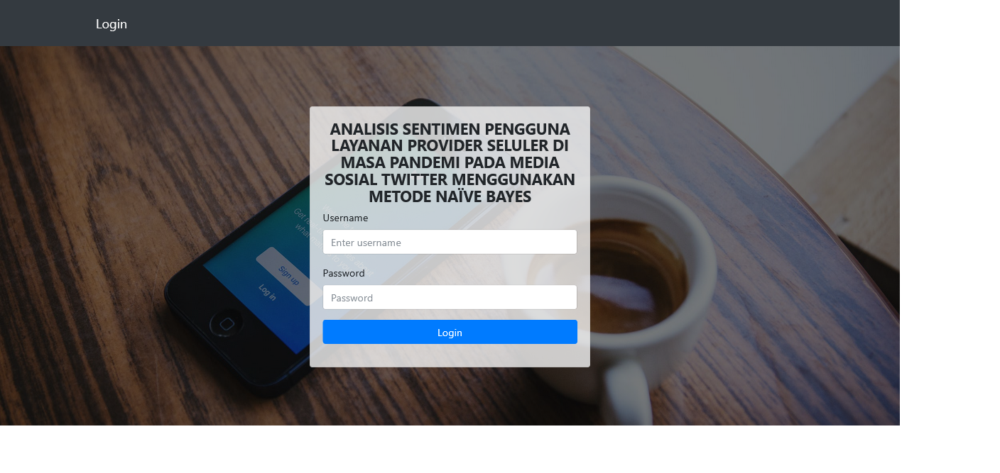

<!-- protected -->
 
<!-- protected -->
### Skripsi Informatika:
## Analisis Sentimen Pengguna Layanan Provider Seluler Di Masa Pandemi Pada Media Sosial Twitter Menggunakan Metode Naive Bayes

> 

### MIT Lisence:
  * All source code protected by MIT Lisence, not allowed to delete "LICENCE" and must include license in the form of "LICENCE" file and copyright of the redistributed coder from (@rusagaib)
  * Seluruh kode program dilindungi dalam Lisensi MIT, tidak diperbolehkan menghapus "LICENCE" dan harus mencantumkan lisensi berupa file "LICENCE" dan hak cipta dari pembuat kode yang didistribusikan ulang dari (@rusagaib)
  * https://github.com/rusagaib/flasksentimentpy
  * https://opensource.org/licenses/MIT

### Buy me some coffe :)
  * https://ko-fi.com/rusagaib

### Sawer ngab :)
  * https://saweria.co/rusagaib

### Fitur:
  * ##### main-program:
    - text-preprocessing pada dataset awal
    - membagi dataset awal 8:2 untuk training dan testing
    - pembobotan tf-idf & pembuatan kamus data (kamus_data_all, kamus_positif & kamus_negatif)
    - klasifikasi menggunakan metode Naive Bayes menggunakan data testing
    - menampilkan akurasi dari confusion matrik & visualisasi dari pengujian data testing
  * ##### Fitur Upload Dataset pada sub-menu dataset
  * ##### Klasifikasi sentimen berdasarkan input manual pengguna (pada menu Dashboard)

### Installasi:

#### 1. Buat virtual environment:
  * cara 1:
    > python3 -m venv env
  * cara 2:
    > virtualenv -p python3 env

  * #### *Jika belum, install virtualenv terlebih dahulu:
    > pip install virtualenv

#### 2. Akses environment yang telah dibuat:
- Linux:
> source env/bin/activate
- Windows:
> buka cmd drag file .bat pada 'nama_projectnya\env\Scripts\activate.bat' ke dalam cmd, tekan enter.

#### 3. install all packages:
> pip install -r requirements.txt

#### 4. Run aplikasi:
#### Run local:
* setting konfigurasi pada file .env
* import "flasksentimen_db.sql" ke database MySQL
* Windows/Linux run:
  > python main_app.py

#### Deploy on production:
  * Shared Hosting (cpanel based "passenger WSGI"):
    - setup aplikasi python dsb pada cpanel
    - konfigurasi/import database MySQL example "database/flasksentimen_db.sql"
    - wajib jangan lupa setting enviroment variable untuk 'FLASK_ENV' ganti menjadi production
    - edit dan sesuaikan file 'config_db.py' comment line ke 2,3 dan 7,8
    - edit dan sesuaikan file 'passenger_wsgi.py'
    - untuk run program (default) pada 'passenger_wsgi.py':
    > "from main_app import app as application"

  * Heroku = -

#### 5. Login (Default):
  * username = admin
  * password = rusagaib

###### *NB sistem belum disertai fitur register pengguna dan konfigurasi akun

###### Get in touch:
> * twitter: @rusagaib
> * github: @rusagaib

## Preview:
 * Login-page:
 
 * Dashboard (testing manual input from user):
 
 * dataset-page:
 
 * output:
 
 * upload-dataset:
 
